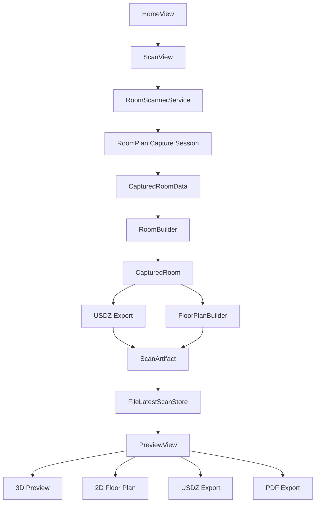
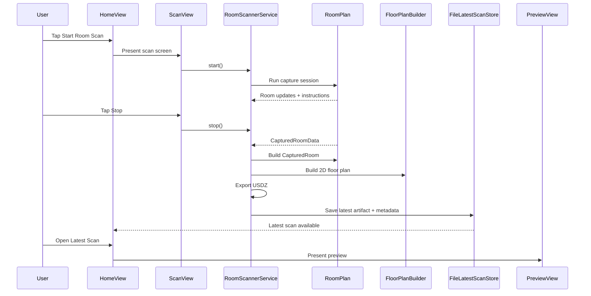
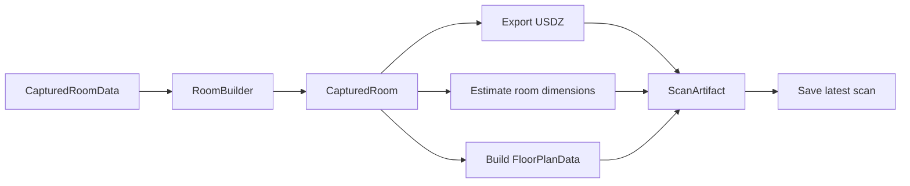
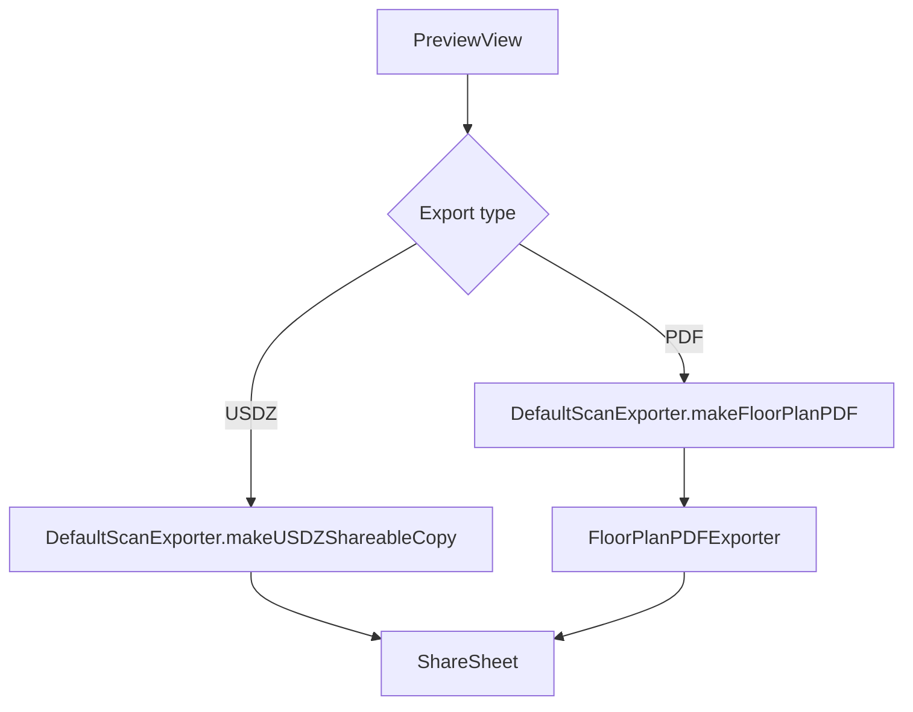

# Slam

Slam is an iPhone app that scans a real room and turns it into a digital room model.

You walk around a room with a LiDAR-enabled iPhone. The app watches the room with the camera and depth sensor, builds a 3D model, saves the scan, shows it back to you, and lets you export it.

It now also creates a simple 2D top-down floor plan and can export that floor plan as a PDF.

## What the app does

- Scans a room with LiDAR
- Builds a 3D room model
- Saves the latest scan on the phone
- Shows the scan in a 3D preview
- Creates a 2D top-down floor plan
- Exports the 3D scan as `USDZ`
- Exports the 2D floor plan as `PDF`

## How it works in simple language

1. You tap **Start Room Scan**.
2. The app opens Apple's RoomPlan capture view.
3. You move around the room slowly.
4. The phone measures walls, openings, and objects it can understand.
5. When you stop, the app asks RoomPlan to finish the room model.
6. The app exports that room as a 3D `USDZ` file.
7. The app also converts the room into a clean 2D floor plan.
8. The latest scan is saved so you can open it again later.
9. In Preview, you can look at the 3D model or the 2D plan and export either one.

## Who this is for

This project is useful if you want to:

- prototype LiDAR room scanning on iPhone
- save and preview RoomPlan scans
- export room scans for viewing or sharing
- generate a simple top-down floor plan from a scan

## Basic requirements

- A LiDAR-capable iPhone or iPad for real scanning
- iOS 17+
- Xcode 15+ recommended
- Camera permission enabled

## Running the app

1. Open [`SlamApp.xcodeproj`](/Volumes/New%20Volume/Projects/Slam/SlamApp.xcodeproj) in Xcode.
2. Choose a real LiDAR device for room scanning.
3. Build and run the `SlamApp` scheme.
4. Tap **Start Room Scan**.

You can build for simulator, but real room capture needs a physical LiDAR device.

## Manual smoke test

See [`MANUAL_DEVICE_CHECKLIST.md`](/Volumes/New%20Volume/Projects/Slam/MANUAL_DEVICE_CHECKLIST.md).

---

## Technical Overview

## Stack

- SwiftUI for app UI
- RoomPlan for room capture and room reconstruction
- ARKit for camera tracking state
- SceneKit for in-app 3D preview
- Quick Look for full-screen 3D viewing
- UIKit/Core Graphics for 2D floor plan rendering
- `UIGraphicsPDFRenderer` for PDF export

## High-Level Architecture



Editable diagrams:

- [`docs/diagrams/app-architecture.excalidraw`](/Volumes/New%20Volume/Projects/Slam/docs/diagrams/app-architecture.excalidraw)
- [`docs/diagrams/scan-and-export-flow.excalidraw`](/Volumes/New%20Volume/Projects/Slam/docs/diagrams/scan-and-export-flow.excalidraw)

## Main user flow



## Project structure

```text
SlamApp/
  App/
    AppEnvironment.swift
    AppModel.swift
    SlamAppApp.swift
  Core/
    Export/
      DefaultScanExporter.swift
      FloorPlanPDFExporter.swift
    FloorPlan/
      FloorPlanBuilder.swift
    Models/
      ScanModels.swift
    Persistence/
      FileLatestScanStore.swift
    Scanning/
      CompletionHeuristic.swift
      RoomScannerService.swift
    Utilities/
      ShareSheet.swift
  Features/
    Home/
      HomeView.swift
    Preview/
      FloorPlanView.swift
      PreviewView.swift
      QuickLookPreview.swift
    Scan/
      RoomCaptureViewContainer.swift
      ScanView.swift
SlamAppTests/
```

## Core responsibilities

### App layer

- [`SlamApp/App/SlamAppApp.swift`](/Volumes/New%20Volume/Projects/Slam/SlamApp/App/SlamAppApp.swift)
  Starts the app and injects `AppModel`.
- [`SlamApp/App/AppEnvironment.swift`](/Volumes/New%20Volume/Projects/Slam/SlamApp/App/AppEnvironment.swift)
  Creates the app dependencies.
- [`SlamApp/App/AppModel.swift`](/Volumes/New%20Volume/Projects/Slam/SlamApp/App/AppModel.swift)
  Coordinates persistence and export actions for the UI.

### Scan flow

- [`SlamApp/Features/Scan/ScanView.swift`](/Volumes/New%20Volume/Projects/Slam/SlamApp/Features/Scan/ScanView.swift)
  User-facing scan screen.
- [`SlamApp/Core/Scanning/RoomScannerService.swift`](/Volumes/New%20Volume/Projects/Slam/SlamApp/Core/Scanning/RoomScannerService.swift)
  Owns the capture session, telemetry, final processing, USDZ export, and floor plan creation.
- [`SlamApp/Core/Scanning/CompletionHeuristic.swift`](/Volumes/New%20Volume/Projects/Slam/SlamApp/Core/Scanning/CompletionHeuristic.swift)
  Decides when the scan appears “good enough” to stop.

### Data model and persistence

- [`SlamApp/Core/Models/ScanModels.swift`](/Volumes/New%20Volume/Projects/Slam/SlamApp/Core/Models/ScanModels.swift)
  Defines `ScanArtifact`, `ScanMetadata`, floor plan types, and export protocols.
- [`SlamApp/Core/Persistence/FileLatestScanStore.swift`](/Volumes/New%20Volume/Projects/Slam/SlamApp/Core/Persistence/FileLatestScanStore.swift)
  Saves only the latest scan:
  - `latest.usdz`
  - `latest-metadata.json`

### Preview and export

- [`SlamApp/Features/Preview/PreviewView.swift`](/Volumes/New%20Volume/Projects/Slam/SlamApp/Features/Preview/PreviewView.swift)
  Main preview screen with 3D / 2D mode switching.
- [`SlamApp/Features/Preview/FloorPlanView.swift`](/Volumes/New%20Volume/Projects/Slam/SlamApp/Features/Preview/FloorPlanView.swift)
  Draws the floor plan using Core Graphics.
- [`SlamApp/Core/FloorPlan/FloorPlanBuilder.swift`](/Volumes/New%20Volume/Projects/Slam/SlamApp/Core/FloorPlan/FloorPlanBuilder.swift)
  Converts `CapturedRoom` into normalized 2D geometry.
- [`SlamApp/Core/Export/DefaultScanExporter.swift`](/Volumes/New%20Volume/Projects/Slam/SlamApp/Core/Export/DefaultScanExporter.swift)
  Produces exportable files.
- [`SlamApp/Core/Export/FloorPlanPDFExporter.swift`](/Volumes/New%20Volume/Projects/Slam/SlamApp/Core/Export/FloorPlanPDFExporter.swift)
  Builds a printable PDF.

## Data model

### `ScanArtifact`

Represents one saved scan session.

- `usdzURL`
- `metadata`
- `createdAt`

### `ScanMetadata`

Stores summary details needed after scanning.

- room dimensions
- wall/opening/object counts
- scan duration
- confidence
- optional `floorPlan`

### `FloorPlanData`

Stores a normalized 2D representation of the room.

- `bounds`
- `walls`
- `openings`
- `objects`
- `majorDimensions`
- `renderDefaults`

## Scan processing pipeline

When scanning ends, the pipeline is:



## 2D floor plan pipeline

The 2D floor plan system works like this:

1. Read walls, openings, and objects from `CapturedRoom`.
2. Convert all geometry into X/Z top-down coordinates.
3. Compute a dominant room angle.
4. Rotate geometry so the plan is easier to read.
5. Compute bounds.
6. Select key wall dimensions.
7. Persist the result in `ScanMetadata`.
8. Render it in-app or into a PDF.

## Floor plan rendering model

`FloorPlanRenderer` in [`FloorPlanView.swift`](/Volumes/New%20Volume/Projects/Slam/SlamApp/Features/Preview/FloorPlanView.swift) is responsible for:

- fitting the room into the available rectangle
- applying padding and scale
- drawing walls
- drawing openings
- drawing object footprints
- drawing object labels
- drawing main dimension labels

This same rendering logic is reused for:

- the in-app 2D preview
- the exported PDF

## Export flow



## Persistence details

The latest scan is stored in application support.

Saved output:

- `LatestScan/latest.usdz`
- `LatestScan/latest-metadata.json`

This means the app currently behaves like a single-slot scanner: it remembers the most recent scan, not a full scan history.

## Testing

Current tests live in [`SlamAppTests`](/Volumes/New%20Volume/Projects/Slam/SlamAppTests):

- [`CompletionHeuristicTests.swift`](/Volumes/New%20Volume/Projects/Slam/SlamAppTests/CompletionHeuristicTests.swift)
- [`DefaultScanExporterTests.swift`](/Volumes/New%20Volume/Projects/Slam/SlamAppTests/DefaultScanExporterTests.swift)
- [`FileLatestScanStoreTests.swift`](/Volumes/New%20Volume/Projects/Slam/SlamAppTests/FileLatestScanStoreTests.swift)

Recommended manual device validation is documented in [`MANUAL_DEVICE_CHECKLIST.md`](/Volumes/New%20Volume/Projects/Slam/MANUAL_DEVICE_CHECKLIST.md).

## Limitations

- Real room capture requires a LiDAR device.
- The app saves only the latest scan.
- Floor plan quality depends on RoomPlan's room understanding.
- The PDF is a simple summary export, not a CAD-grade drawing.
- Measurements are approximate.

## Future documentation ideas

- full scan history support
- measurement tools in preview
- PNG export for 2D plans
- richer floor plan annotation rules
- architecture decision records for scan/export tradeoffs
